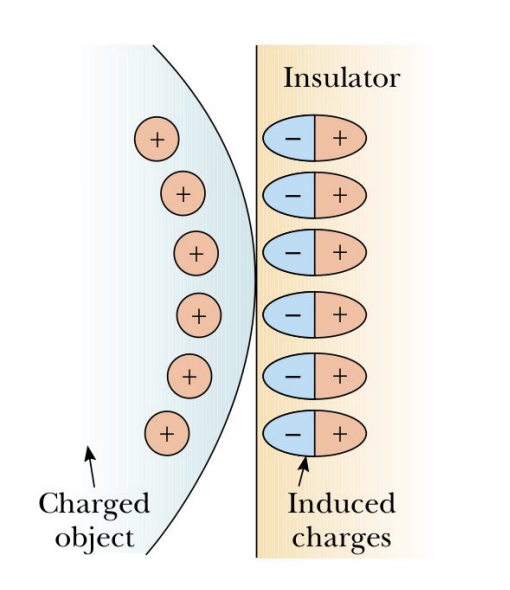

# ⚡ Campo Elettrico - Parte 1

## 📚 Fondamenti Avanzati di Fisica

👨‍🏫 **Docente:** Marco Pizzichemi  
📧 **Email:** marco.pizzichemi@unimib.it  

---

## 1️⃣ La Forza Elettrica

### 🔋 Cariche Elettriche e Forze

Esperimenti semplici dimostrano l'esistenza delle forze elettriche:

- Una **bacchetta di vetro** strofinata con **seta** attrae una bacchetta di gomma.
- Due **bacchette di gomma** strofinata con pelliccia si respingono.

### ⚛️ Proprietà delle Cariche Elettriche

- **Due tipi di cariche:** positiva e negativa.
- **Legge fondamentale:**  
  - Cariche **dello stesso segno** si respingono.
  - Cariche **di segno opposto** si attraggono.
- **Conservazione della carica:** In un sistema isolato, la carica totale rimane costante.
- **Quantizzazione della carica:** La carica è sempre un multiplo intero della carica elementare:

$$
e = 1.6 \times 10^{-19} C
$$

- L'unità di misura della carica elettrica è il **Coulomb**:  

$$
1 C = 1 A \cdot s
$$

### ⚙️ Conduttori e Isolanti

I materiali possono essere suddivisi in:

| **Tipo**     | **Esempi**                   |
|-------------|-----------------------------|
| **Conduttori** | Argento, rame, oro (metalli) |
| **Isolanti**  | Vetro, gomma, plastica      |

- **Conduttori:** Contengono **elettroni liberi** che possono muoversi facilmente.
- **Isolanti:** Gli elettroni sono **legati agli atomi** e non possono muoversi liberamente.
- **Semiconduttori:** Materiali con proprietà intermedie, verranno studiati più avanti.

---

## 2️⃣ Induzione Elettrica

### 🔄 Carica per Induzione nei Conduttori

Un conduttore può essere caricato **senza contatto** tramite **induzione**:

1. Una **sfera metallica neutra** ha uguali cariche positive e negative.
2. Avvicinando una **bacchetta carica**, le cariche nella sfera **si ridistribuiscono**.
3. Se la sfera è **messa a terra**, alcuni elettroni fluiscono via.
4. Dopo aver **rimosso la messa a terra**, la sfera rimane **carica positivamente**.
5. Alla fine, rimuovendo la bacchetta, le cariche si **ridistribuiscono uniformemente**.

### 🔬 Induzione negli Isolanti

Negli isolanti, la carica non può muoversi liberamente, ma:

- Un oggetto carico può **polarizzare** le molecole dell'isolante.
- Il centro delle cariche positive e negative **non coincide più**, formando un **dipolo elettrico**.

Esempio: la **molecola d'acqua** è naturalmente un dipolo permanente.

---

## 3️⃣ La Legge di Coulomb ⚖️

Descrive la forza tra due cariche puntiformi $q_1$ e $q_2$:

$$
F = k_e \frac{|q_1 q_2|}{r^2}
$$

- **Direzione:** lungo la linea che collega $q_1$ e $q_2$.
- **Intensità:** inversamente proporzionale a $r^2$.
- **Segno:**  
  - **Attrattiva** se le cariche sono di segno opposto.  
  - **Repulsiva** se le cariche hanno lo stesso segno.

Dove:

$$
k_e = 8.99 \times 10^9 \, N \cdot m^2 / C^2
$$

Oppure in termini della **costante dielettrica del vuoto**:

$$
k_e = \frac{1}{4 \pi \varepsilon_0}
$$

con:

$$
\varepsilon_0 = 8.85 \times 10^{-12} \, C^2 / N \cdot m^2
$$

### ⚠️ Nota sui Vettori

La forza è un **vettore**, quindi rispetta la **terza legge di Newton**:  
La forza esercitata da $q_1$ su $q_2$ è uguale e opposta a quella di $q_2$ su $q_1$.

---

## 4️⃣ Campo Elettrico 🌌

Il **campo elettrico** è la regione di spazio intorno a una carica in cui altre cariche subiscono una forza.

Definizione del campo elettrico generato da una **carica puntiforme $q$**:

$$
\mathbf{E} = \frac{\mathbf{F}}{q_0}
$$

dove $q_0$ è una carica di prova.

**Formula generale per una carica puntiforme**:

$$
\mathbf{E} = k_e \frac{q}{r^2} \hat{r}
$$

**Caratteristiche:**
- $\mathbf{E}$ è creato dalla carica sorgente $q$, non dalla carica di prova $q_0$.
- La carica di prova serve solo come **rivelatore** del campo.

---

## 5️⃣ Distribuzioni di Carica 📈

Quando le cariche sono distribuite in un'area, si deve calcolare il campo totale come somma vettoriale:

$$
\mathbf{E}_{tot} = \sum_i \mathbf{E}_i
$$

Per distribuzioni continue, il calcolo diventa un **integrale**:

$$
\mathbf{E} = \int \frac{dq}{r^2} \hat{r}
$$

**Densità di carica:**
- **Lineare** $\lambda: \( dq = \lambda \, dx \)$
- **Superficiale** $(\(\sigma\)): \( dq = \sigma \, dA \)$
- **Volumetrica** $(\(\rho\)): \( dq = \rho \, dV \)$

Esempi:

1. **Asta carica uniformemente**:
   - Lunghezza $l$, densità $\lambda$, carica totale $Q = \lambda l$.
   - Campo elettrico ottenuto con integrazione.

2. **Anello carico uniformemente**:
   - Carica $Q$, raggio $a$.
   - Il campo lungo l'asse centrale è dato da:

   $$
   E = \frac{1}{4 \pi \varepsilon_0} \frac{Q x}{(x^2 + a^2)^{3/2}}
   $$

3. **Disco uniformemente carico**:
   - Integrando gli anelli concentrici, si ottiene il campo risultante.

Se il punto è **molto vicino** al disco, il campo è approssimato come quello di un **piano infinito**:

$$
E = \frac{\sigma}{2 \varepsilon_0}
$$

---

## 6️⃣ Linee del Campo Elettrico 🔀

Un modo intuitivo per rappresentare il campo è usare **linee di campo elettrico**:

- **Direzione**: La linea è **tangente** al vettore $\mathbf{E}$ in ogni punto.
- **Densità delle linee**: Indica la **magnitudine** del campo.

---

## 7️⃣ Moto di una Carica in un Campo Elettrico 🚀

Se una carica $q$ entra in un campo $\mathbf{E}$, subisce una forza:

$$
\mathbf{F} = q \mathbf{E}
$$

Se la carica ha massa $m$, allora per la **seconda legge di Newton**:

$$
\mathbf{a} = \frac{q \mathbf{E}}{m}
$$

Se un **elettrone** viene sparato orizzontalmente tra due piastre cariche, la sua **traiettoria sarà parabolica**, come in un moto uniformemente accelerato.

---

📌 **Fine della lezione!**  
⚡ **Prossimamente: approfondimenti sul campo elettrico!** 🔬
