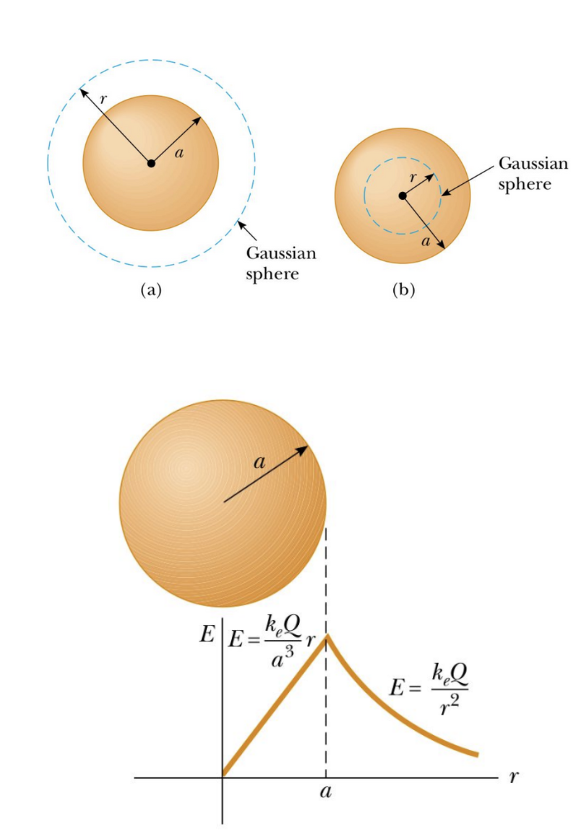
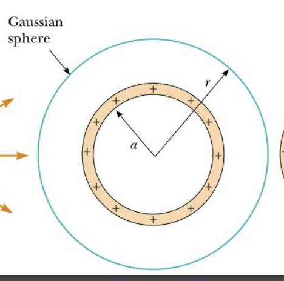
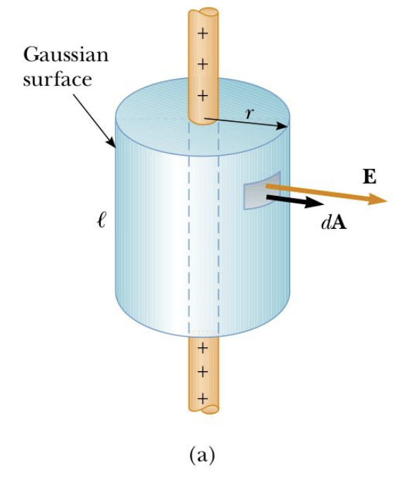
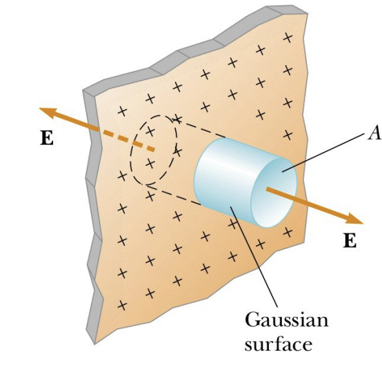

# 📡 Campo Elettrico - Parte 2

**Autore**: Marco Pizzichemi  
📧 *marco.pizzichemi@unimib.it*  

---

## ⚡ 1. Legge di Gauss

### 🔹 Flusso elettrico  
Consideriamo un campo elettrico uniforme in modulo e direzione, le cui linee di forza attraversano una superficie rettangolare posta perpendicolarmente.  

- La densità delle linee di campo è proporzionale all'intensità del campo elettrico \(E\).
- Il **flusso elettrico** è il prodotto dell'intensità \(E\) e della superficie \(A\):

$$
  \Phi_E = E \cdot A
$$

- Se le linee non sono perpendicolari alla superficie, si deve integrare:

$$
  \Phi_E = \int_S \mathbf{E} \cdot d\mathbf{A}
$$

  Per una superficie chiusa:

$$
  \Phi_E = \oint_S \mathbf{E} \cdot d\mathbf{A}
$$

### 🔹 Legge di Gauss  
Consideriamo una carica positiva \(q\) al centro di una sfera di raggio \(r\):

- Il campo sulla sfera è:

$$
  E = \frac{k_e q}{r^2}
$$

- Il flusso attraverso la superficie sferica è:

$$
  \oint_S \mathbf{E} \cdot d\mathbf{A} = \frac{q_{\text{in}}}{\varepsilon_0}
$$

- Questo è vero per qualsiasi distribuzione di carica chiusa in una superficie gaussiana.

### 🛠️ Uso della Legge di Gauss  
È utile per trovare campi elettrici in distribuzioni **ad alta simmetria**.

📌 **Condizioni ideali per una superficie gaussiana**:
- Il campo è costante su tutta la superficie.
- Il campo è parallelo o perpendicolare agli elementi di superficie.
- Il campo è nullo su parte della superficie.

---

## ⚪ 2. Distribuzioni di Carica Simmetriche

 
  
### 🔹 Sfera uniformemente carica
Un'**sfera isolante** di raggio \(a\) e densità di carica \(\rho\) ha carica totale \(Q\).  

- **Fuori dalla sfera** (\(r > a\)):

$$
  E = \frac{k_e Q}{r^2}
$$

- **Dentro la sfera** (\(r < a\)):

$$
  E = \frac{k_e Q r}{a^3}
$$

 
 

 
 

 
  
### 🔹 Guscio sferico uniformemente carico  
- **All'esterno** è uguale al campo di una carica puntiforme \(Q\):

$$
  E = \frac{k_e Q}{r^2}
$$

- **All'interno** è **zero** 🚫, poiché $q_{\text{in}} = 0$.

 
 
 
 

 
  
### 🔹 Filo infinitamente lungo con densità di carica \(\lambda\)  
Per un **cilindro gaussiano** di raggio \(r\):

$$
  E = \frac{\lambda}{2 \pi \varepsilon_0 r}
$$

 
 
 
 

 
  
### 🔹 Piano infinitamente carico con densità superficiale \(\sigma\)  
Per un **cilindro gaussiano perpendicolare al piano**:

$$
  E = \frac{\sigma}{2 \varepsilon_0}
$$

📌 **Nota**: Il campo è **uniforme** e non dipende dalla distanza dal piano.

---

## 🔋 3. Conduttori in Equilibrio

🚀 **Proprietà fondamentali**:
1. Il campo elettrico all'interno è **zero** (altrimenti le cariche si muoverebbero).
2. Se carico, la carica si distribuisce **sulla superficie**.
3. Il campo esterno è **perpendicolare** alla superficie.
4. Su un conduttore irregolare, la **densità di carica** è maggiore dove la curvatura è più elevata ⚡.

---

## 🔌 4. Potenziale Elettrico

### 🔹 Energia potenziale e potenziale  
Essendo la forza di Coulomb conservativa, si può definire l'**energia potenziale elettrica**:

$$
  dU = -\mathbf{F} \cdot d\mathbf{s}
$$

- Il **potenziale elettrico** è:

$$
  V = \frac{U}{q_0}
$$

  ed è misurato in **Volt** $[V] = [J/C]$.

### 🔹 Differenza di potenziale  
Tra due punti A e B:

$$
\Delta V = - \int_{A}^{B} \vec{E} \cdot d\vec{s} 
$$

📌 **Nota**: Le linee di campo vanno da potenziali **alti a bassi**.

### 🔹 Potenziale di una carica puntiforme  
Derivando dalla definizione di V:

$$
  V = \frac{k_e q}{r}
$$

  📌 **Superposizione**: Il potenziale di un sistema di cariche è la somma dei singoli contributi.

$$
V = k_e \sum_{i} \frac{q_i}{r_i}
$$

### 🔹 Potenziale di un conduttore

The surface of any charged conductor in equilibrium is an **equipotential surface**
Take two points, A and B. If we move from A to B, on the surface, E is always
perpendicular to the displacement. 

---

## ⚙️ 5. Capacità e Condensatori

### 🔹 Definizione di capacità  
Un **condensatore** è formato da due conduttori con cariche opposte. La capacità è definita come:

$$
  C = \frac{Q}{V}
$$

  📌 **Unità di misura**: **Farad** \([F] = [C/V]\).

### 🔹 Condensatore a **piastre parallele**  
Per due piastre di area \(A\) separate da \(d\):

$$
  C = \frac{\varepsilon_0 A}{d}
$$

📌 **Nota**: Per piastre molto grandi il campo è **uniforme**.

### 🔹 Condensatore **cilindrico**  
Per un cilindro di raggio \(a\) e un guscio esterno di raggio \(b\):

$$
  C = \frac{2\pi \varepsilon_0 l}{\ln(b/a)}
$$

### 🔹 Dielettrici nei condensatori  
Un **dielettrico** (vetro, plastica, ecc.) **aumenta** la capacità:
If the dielectric completely fills the space between the plates, the voltage measured between the plates
decreases by a factor $κ$ known as the dielectric constant of the material

$$
\Delta V = \frac{\Delta V_0}{\kappa}
$$

$$
C = \frac{Q_0}{\Delta V} = \frac{Q_0}{\Delta V_0 / \kappa} = \kappa \frac{Q_0}{\Delta V_0} \Rightarrow C = \kappa C_0
$$
$$
  C' = \kappa C
$$

  📌 **Nota**: Il fattore \(\kappa\) (costante dielettrica) riduce il campo e la tensione tra le piastre.

---
