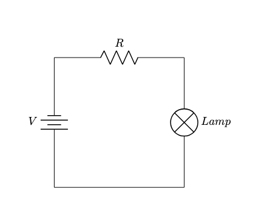
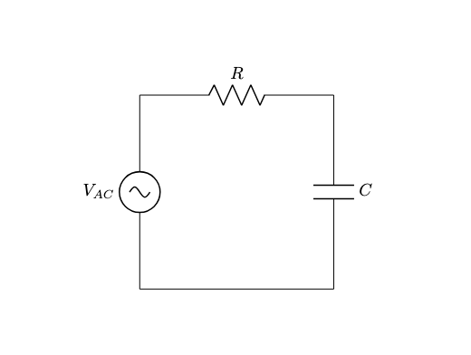

# Introduzione ai Circuiti Elettrici 🚀

Benvenuti alla lezione di oggi sui circuiti elettrici! Esploreremo i concetti fondamentali di corrente, potenziale e circuiti elettrici semplici. Sentitevi liberi di fare domande e, se preferite non essere registrati, fatemelo sapere. Iniziamo!

---

## ⚡ Corrente Elettrica e Convenzioni

### 📌 Definizione di Corrente Elettrica
La corrente elettrica è il flusso di carica elettrica, tipicamente confinato all'interno di circuiti composti da materiali conduttori, come i fili. Questo flusso richiede materiali conduttori e permette diverse configurazioni e modelli di circuiti elettrici.

### 🔄 Tipi di Circuiti
 
 

 
   
1. **Corrente Continua (DC):**  
   - La corrente scorre costantemente in una direzione.  
   - Un generatore fornisce la corrente dal polo positivo a quello negativo, secondo la convenzione di flusso da positivo a negativo.  

 
 

 
   
2. **Corrente Alternata (AC):**  
   - La corrente cambia direzione periodicamente.  
   - Il generatore in un circuito AC non mantiene una polarità fissa, permettendo alla corrente di alternarsi.  

  

### 📏 Intensità di Corrente
L’intensità di corrente $I$ è definita come il tasso di flusso della carica attraverso una sezione trasversale del filo:

$$
I = \frac{dQ}{dt}
$$

dove $Q$ è la carica e $t$ è il tempo.

---

## 🔍 Vista Microscopica del Flusso di Corrente

 
   
### ⚛️ Portatori di Carica
- Il flusso di corrente è dovuto ai portatori di carica, tipicamente elettroni nei conduttori.
- La velocità di deriva media di questi portatori di carica è molto piccola.

### 🧮 Rappresentazione Matematica
La corrente può essere espressa come:

$$
\frac{dq}{dt} = e \cdot \frac{N}{dt} = e n \frac{V}{dt} = e n \frac{A ds}{dt} = i
$$

$$
I = n \cdot A \cdot v_d \cdot e
$$

 
dove:
- N è il numero dei portatori di carica
- $n$ è la densità dei portatori di carica,
- $A$ è l'area della sezione trasversale del filo,
- $v_d$ è la velocità di deriva,
- $e$ è la carica elementare.

---

## 🔌 Resistenza e Legge di Ohm

### 📏 Conduttori Ohmici
La relazione tra tensione $V$ e corrente $I$ è lineare:

$$
V = I \cdot R
$$

dove $R$ è la resistenza.

### 🏗️ Fattori che Influenzano la Resistenza
La resistenza dipende dalla resistività del materiale $\rho$, dalla lunghezza $L$ e dall'area della sezione trasversale $A$:

$$
R = \rho \cdot \frac{L}{A}
$$

### 🔥 Dissipazione di Potenza
La potenza $P$ dissipata in un resistore è data da:

$$
P = I^2 \cdot R = \frac{V^2}{R}
$$

---

## 🔄 Tecniche di Analisi dei Circuiti

### 🔗 Circuiti in Serie e in Parallelo
1. **Circuiti in Serie:**  
   - Resistenza totale:

     $$
     R_{\text{totale}} = R_1 + R_2 + \dots + R_n
     $$

   - La stessa corrente scorre attraverso ogni componente.

2. **Circuiti in Parallelo:**  
   - Resistenza totale:

     $$
     \frac{1}{R_{\text{totale}}} = \frac{1}{R_1} + \frac{1}{R_2} + \dots + \frac{1}{R_n}
     $$

   - La stessa tensione è applicata a ogni componente.

### ⚖️ Leggi di Kirchhoff
1. **Legge delle Tensioni di Kirchhoff (KVL):**  
   - La somma di tutte le tensioni in un circuito chiuso è zero.

2. **Legge delle Correnti di Kirchhoff (KCL):**  
   - La somma delle correnti entranti in un nodo è uguale alla somma delle correnti uscenti.

---

## 🔋 Condensatori e Accumulo di Energia

### ⚡ Condensatori nei Circuiti
- I condensatori immagazzinano energia in un campo elettrico tra due piastre.
- La carica $Q$ su un condensatore è data da:

  $$
  Q = C \cdot V
  $$

  dove $C$ è la capacità.

### 🔄 Carica e Scarica di un Condensatore
- **Carica:** La tensione su un condensatore aumenta man mano che accumula carica.
- **Scarica:** L’energia immagazzinata viene rilasciata, causando una diminuzione della tensione.

### ⏳ Costante di Tempo
- La costante di tempo $\tau$ per un circuito resistivo-capacitivo (RC) è:

  $$
  \tau = R \cdot C
  $$

  Indica la velocità con cui un condensatore si carica o si scarica.

---

## 🌟 Concetti Avanzati e Applicazioni

### 🎛️ Circuiti AC e Filtri
- I condensatori possono essere utilizzati per filtrare segnali, permettendo il passaggio solo di determinate frequenze.
- **Filtri passa-alto** permettono il passaggio dei segnali ad alta frequenza, bloccando quelli a bassa frequenza.

### 🏠 Applicazioni nel Mondo Reale
- I circuiti elettrici sono fondamentali nei cablaggi domestici, nei dispositivi elettronici e molto altro.
- Comprendere il comportamento dei circuiti aiuta a progettare sistemi più efficienti.

---

## 🎯 Conclusione

Oggi abbiamo esplorato i concetti essenziali dei circuiti elettrici, tra cui corrente, resistenza, condensatori e tecniche di analisi dei circuiti. Questi concetti sono la base per argomenti più avanzati. Alla prossima lezione! 😊
